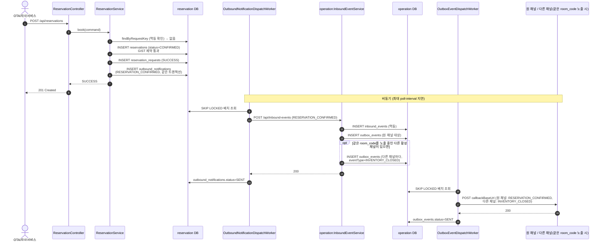
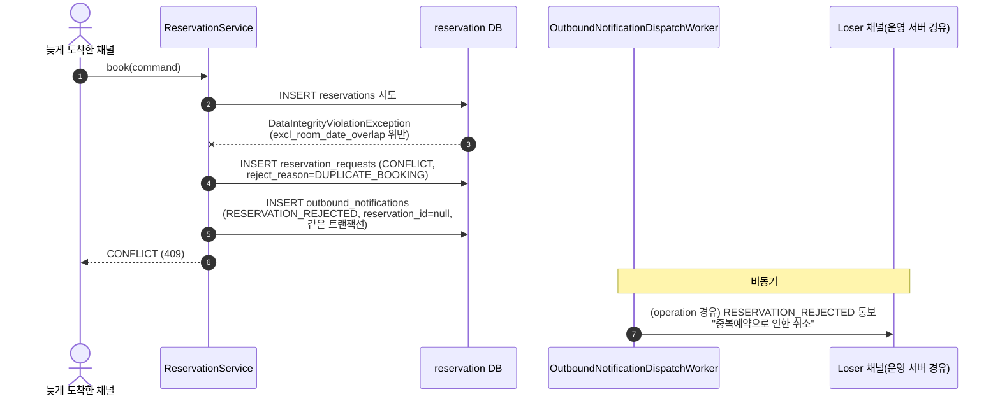

# BOOK — 예약 요청

`POST /api/reservations` → `ReservationService.book()`. 기획문서 4.1(OTA 예약 요청).

- 멱등키: `platformId:platformReservationRef:roomCode:startDate:endDate:BOOK` (`buildBookRequestKey`)
- 동시성 방어: 애플리케이션 선점 조회 없이, `reservations`의 `EXCLUDE USING GIST(room_code, date_range)` 제약 위반(`DataIntegrityViolationException`)을 그대로 신뢰
- HOST는 BOOK을 시작할 수 없음(`initiatedBy == HOST`면 즉시 `IllegalArgumentException`)

## 성공 케이스

다이어그램 소스: [`01-book-success.mermaid`](01-book-success.mermaid)

## 중복예약 거부 케이스 (오버부킹)

같은 `room_code`·겹치는 날짜로 두 요청이 동시에 들어와 GIST 제약을 어느 한쪽이 위반하는 경우.

다이어그램 소스: [`01-book-conflict.mermaid`](01-book-conflict.mermaid)

