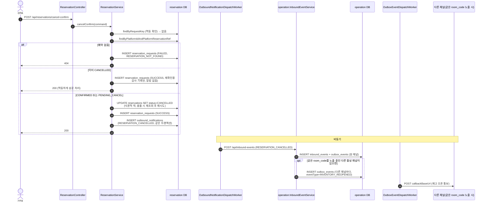

# CANCEL_CONFIRM — OTA 취소통보

`POST /api/reservations/cancel-confirm` → `ReservationService.cancelConfirm()`. 기획문서 2.3/4.2 —
"누가 취소를 시작했든, 최종 확정 시점은 항상 OTA의 취소통보가 도착한 시점". **거부 불가**: 통보이므로
도착 즉시 확정 처리한다.

- 멱등키: `externalRequestId`가 있으면 `platformId:externalRequestId`, 없으면
  `platformId:platformReservationRef:CANCEL_CONFIRM:초단위시각`로 폴백
- 낙관적 락(`version`) 충돌 시 트랜잭션 바깥에서 재시도(최대 3회) — 실패한 트랜잭션의 세션을
  재사용하면 "예외 후 flush" 문제가 생기기 때문

