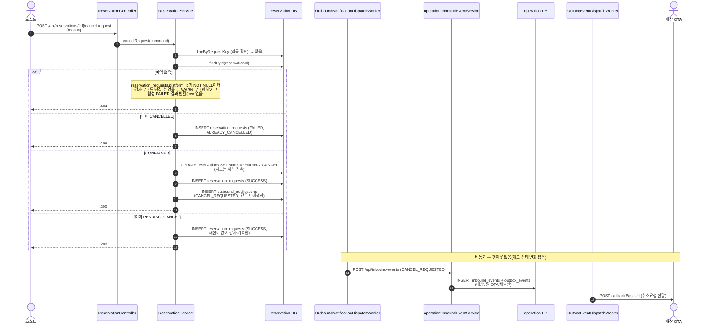
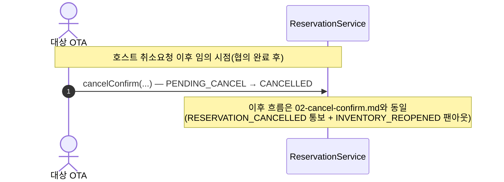

# CANCEL_REQUEST — 호스트 취소요청 (2단계)

`POST /api/reservations/{reservationId}/cancel-request` → `ReservationService.cancelRequest()`.
기획문서 2.3/4.3 — 호스트는 취소를 **요청**만 할 수 있고, 확정 권한은 없다. 대상 OTA에게 요청이
전달된 뒤 그 OTA의 취소통보([02-cancel-confirm.md](02-cancel-confirm.md))가 돌아와야 비로소
확정된다. 그 전까지 재고는 계속 점유 상태(`PENDING_CANCEL`)로 유지된다.

- 멱등키: `externalRequestId`가 있으면 `reservationId:CANCEL_REQUEST:externalRequestId`, 없으면
  `reservationId:CANCEL_REQUEST:초단위시각`로 폴백
- `PENDING_CANCEL`도 `reservations`의 GIST exclusion 제약 대상에 포함되어 있어, 이 기간 동안도
  같은 room_code·겹치는 날짜의 신규 BOOK은 계속 거부된다(재고 점유 유지)
- 이 액션 자체는 재고를 실제로 바꾸지 않으므로(여전히 점유 상태) `operation`의 채널 팬아웃 대상이
  아니다 — 팬아웃은 `RESERVATION_CONFIRMED`/`RESERVATION_CANCELLED`에서만 발생

## 1단계 — 호스트 취소요청 → PENDING_CANCEL

다이어그램 소스: [`03-cancel-request-phase1.mermaid`](03-cancel-request-phase1.mermaid)

## 2단계 — OTA가 취소통보를 보내야 최종 확정

호스트 취소요청을 전달받은 OTA가 고객과 협의를 마치고 나면, [02-cancel-confirm.md](02-cancel-confirm.md)와
**완전히 동일한 플로우**로 `POST /api/reservations/cancel-confirm`을 호출한다. `attemptCancelConfirm`은
`CONFIRMED`와 `PENDING_CANCEL` 둘 다에서 `CANCELLED`로의 전이를 허용하므로 별도 분기가 필요 없다.

다이어그램 소스: [`03-cancel-request-phase2.mermaid`](03-cancel-request-phase2.mermaid)

