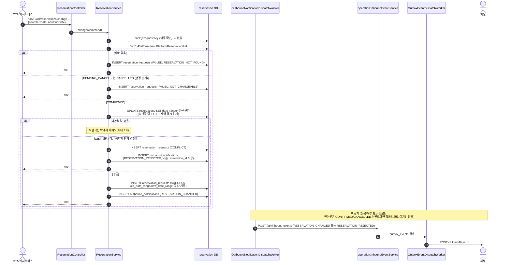

# CHANGE — 예약 변경

`POST /api/reservations/change` → `ReservationService.change()`. 기획문서 4.4 — "취소+재예약"이
아닌 기존 예약 건에 대한 날짜 변경으로 취급한다. HOST는 시작할 수 없다.

- 멱등키: `externalRequestId`가 있으면 `platformId:externalRequestId`, 없으면
  `platformId:platformReservationRef:CHANGE:초단위시각`로 폴백
- 변경 가능한 상태는 `CONFIRMED`뿐 — `PENDING_CANCEL`/`CANCELLED`는 변경 불가로 거부
- 낙관적 락 충돌(재시도 대상)과 GIST exclusion 위반(진짜 날짜 겹침, 재시도해도 다시 겹침)을 재시도
  루프 안에서 서로 다르게 처리하는 첫 액션 — 겹침은 예약 row가 이미 존재해 `reservation_id`를
  채울 수 있으므로, BOOK과 달리 거부 통보(`RESERVATION_REJECTED`)를 실제 예약에 연결해 남긴다

