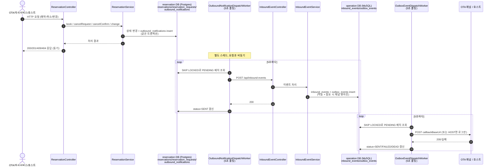

# PMS 데이터플로우

`reservation`(PostgreSQL)과 `operation`(MySQL) 두 서버가 HTTP로만 통신하며 Transactional Outbox로
서로에게 이벤트를 신뢰성 있게 전달하는 구조를 시퀀스 다이어그램으로 정리한다. 각 다이어그램은
실제 병합된 코드(컨트롤러/서비스 메서드명, 이벤트 타입 문자열, 폴링 워커) 기준이다 — 상세 설계
근거는 `docs/기획문서.md`와 `plan/*.md`를 참고.

## 아키텍처 개요

## 흐름별 다이어그램

| 파일 | 시나리오 |
|---|---|
| [01-book.md](01-book.md) | 예약 요청(BOOK) — 성공/중복예약 거부, `operation` 채널 팬아웃(`INVENTORY_CLOSED`) 포함 |
| [02-cancel-confirm.md](02-cancel-confirm.md) | OTA 취소통보(CANCEL_CONFIRM) — 즉시 확정, `INVENTORY_REOPENED` 팬아웃 포함 |
| [03-cancel-request.md](03-cancel-request.md) | 호스트 취소요청(CANCEL_REQUEST) — PENDING_CANCEL 전이 후 OTA 취소통보로 최종 확정(2단계) |
| [04-change.md](04-change.md) | 예약 변경(CHANGE) — 성공/겹침 거부 |

## 공통 신뢰성 원칙

- **멱등성**: 모든 액션은 `request_key`(BOOK/CHANGE는 채널+상품+날짜 또는 `externalRequestId`, CANCEL_CONFIRM/CANCEL_REQUEST는 `externalRequestId` 우선·없으면 초단위 폴백)로 중복 요청을 감지해 재처리 없이 이전 결과를 반환한다.
- **동시성**: `reservations` 테이블의 PostgreSQL `EXCLUDE USING GIST` 제약이 같은 `room_code`·겹치는 날짜의 동시 확정을 DB 레벨에서 막는다(애플리케이션 레벨 선점 조회 없음).
- **전달 신뢰성(Outbox)**: 상태 변경과 outbox row insert가 항상 같은 트랜잭션. 별도 스케줄러가 `SKIP LOCKED`로 배치 폴링 후 HTTP 전송, 실패 시 지수 백오프 재시도, `maxRetryCount` 초과 시 DEAD.
- **추적성**: `reservation_requests`(reservation)/`inbound_events`+`outbox_events`(operation)에 append-only로 이력이 남는다.
